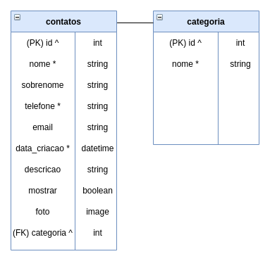

[](https://python.org)
[](https://www.djangoproject.com/)


<h1 align="center">Agenda</h1>

<p align="center">
  <a href="#about-the-project">About The Project</a>&nbsp;&nbsp;&nbsp;|&nbsp;&nbsp;&nbsp;
  <a href="#usage">Usage</a>&nbsp;&nbsp;&nbsp;|&nbsp;&nbsp;&nbsp;
  <a href="#installation">Installation</a>&nbsp;&nbsp;&nbsp;|&nbsp;&nbsp;&nbsp;
  <a href="#contributing">Contributing</a>
</p>

<br>

## About The Project


> Contact book with login

### Built With

* HTML
* CSS
* Bootstrap
* Django

<!-- USAGE -->
## Usage


### Database diagram



<br>

<!-- INSTALATION -->
## Installation
#### 1. Install Python
Install ```python-3.7``` or higher and ```python-pip```

```bash
sudo apt install python3 && sudo apt install python-pip
```

#### 2. Clone git repository
```bash
git clone "https://github.com/almeida-matheus/agenda.git"
```

#### 3. Setup virtual environment
```bash
# Install virtual environment
sudo apt-get install python3-venv

# Create virtual environment
python3 -m venv env

# Activate virtual environment
source /env/bin/activate
```
#### 4. Install requirements
```bash
# Enter the django project directory
cd agenda/agenda/

# Install the necessary libraries
pip3 install -r requirements.txt
```
#### 5. Run the server
```bash
# Make migrations and create database
python manage.py makemigrations
python manage.py migrate

# Run the server
python manage.py runserver

```
The project will be available at [http://localhost:8000](http://localhost:8000) in the browser
<!-- CONTRIBUTING -->
## Contributing
Contributions are what make the open source community such an amazing place to be learn, inspire, and create. Any contributions you make are **greatly appreciated**

1. Fork the Project
2. Clone this project (`git checkout -b feature/AmazingFeature`)
3. Create your Feature Branch (`git checkout -b feature/AmazingFeature`)
4. Commit your Changes (`git commit -m 'Add some AmazingFeature'`)
5. Push to the Branch (`git push origin feature/AmazingFeature`)
6. Open a Pull Request
